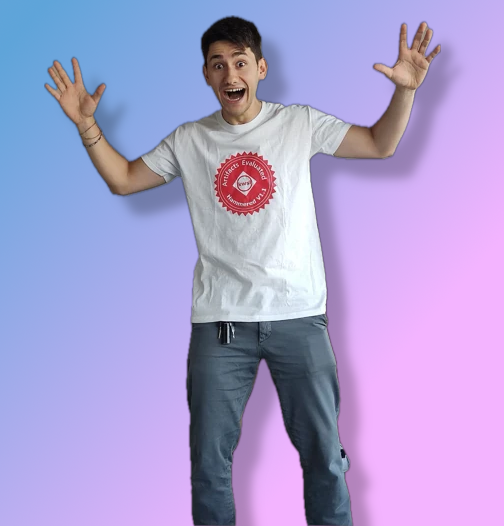
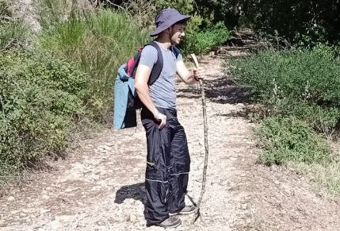

### mell-o-tron
I'm a computer scientist with a MSc in Theoretical CS. My main projects are [MellOS](https://github.com/mell-o-tron/MellOs) and [`perk`](https://github.com/Alex23087/Perk).

I really like mathematics, hiking, pull-up bars, music, cats and food.

  </img>&emsp;&emsp; </img>

### A link..
[..to a website containing more info about me](https://mell-o-tron.github.io/)

### A quote
*Computer science is no more about computers than astronomy is about telescopes* (*not(?)* E.W.D.)
